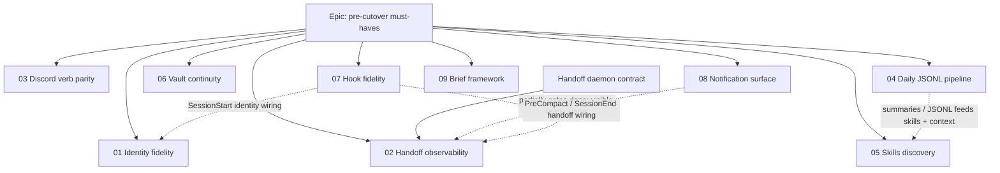
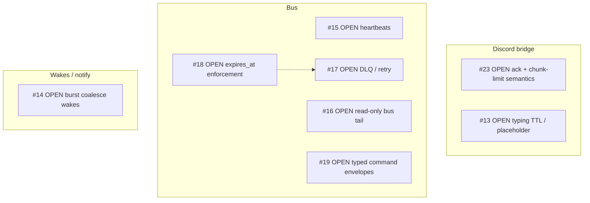

# Pepper cutover — playbook

**Purpose:** how to work each Pepper cutover ticket, where the specs live, and how the per-ticket state is tracked.

**Mode of work:** solo coding agent + adversarial subagent reviews + direct commits to `main`. The earlier multi-implementer roster (Vale / Locke / Folio) and the Cadence PR agent are gone — that flow is no longer used.

**Index of this directory:** [`README.md`](README.md). **Test playbooks (deferred verification):** [`docs/cutover/test-playbooks/`](../cutover/test-playbooks/).

---

## Per-ticket flow

For every cutover ticket:

1. **Read the spec.** Open the ticket's `pepper-cutover-NN-…md` first. Then open every doc linked from its **Related** / **Parent** frontmatter and any in-body `…md` / `…yaml` links. The links are the project's way of saying "read this before you implement."
2. **Map spec to repo (§3b below).** Some behavior may already be on `main`. Before writing code, list each acceptance bullet and mark **met / partial / missing** with evidence. Only implement the gaps.
3. **Implement.** One ticket at a time. Branching is optional for solo — direct edits on `main` are acceptable; use a feature branch if the change is large enough that a wrong commit would be costly to revert.
4. **Adversarial review.** Dispatch the `superpowers:code-reviewer` subagent with full context (what changed, what to attack, files to read). Apply must-fix and should-fix findings. Re-run tests + lint.
5. **Commit to `main`** with a focused message. One concern per commit (per repo `CLAUDE.md`).
6. **Write the test playbook entry** at `docs/cutover/test-playbooks/NN-slug.md`. This is **deferred verification** — describes what to verify at the end-of-cutover gate, not something to run incrementally.
7. **Update the per-ticket status table** at the bottom of this playbook.

---

## Superpowers skills (use the plugin where it fits)

The Superpowers skills cover the disciplines this work expects. Use them by name:

| When | Skill |
|------|-------|
| Multi-step / unclear scope before code | `superpowers:writing-plans` |
| Behavior change or bugfix | `superpowers:test-driven-development` + `superpowers:systematic-debugging` |
| Before claiming done | `superpowers:verification-before-completion` |
| Adversarial review of a finished slice | `superpowers:code-reviewer` (subagent) |
| Branch is green, deciding integration shape | `superpowers:finishing-a-development-branch` |

If Superpowers is not available in the host, mirror the same discipline (plan → test-first when appropriate → debug with evidence → verify before done → adversarial review).

---

## §3b — When work might already be on `main`

Cutover items can be ahead of, behind, or wrong-shape vs. their spec. Do this before any large diff:

1. **Map spec to repo.** Search packages and `docs/examples/` for the tools, events, and filenames the ticket names. Skim recent `main` history if helpful.
2. **Score acceptance literally.** For each "Done looks like" bullet, mark **met / partial / missing** with evidence (command output, file path, test name).
3. **Choose a path:**

| Situation | Action |
|-----------|--------|
| All acceptance criteria met on `main` | Small commit that adds or tightens **tests**, **docs**, or **status** so "done" is auditable. Then write the test playbook entry and update the status table. |
| Partially met | Implement only the gaps. Keep the gap list alive in the commit message until closed. Avoid scope creep. |
| Wrong shape | Prefer one commit that aligns behavior to the spec. If the spec itself is what needs to change, do that as a separate doc commit first. Do not silently redefine "done" in code only. |

Status moves to **Implementation complete** only when the spec and reality match — not when adjacent code lands.

---

## Dependency diagrams (sequencing hints)

Use these to choose the next ticket, not to skip prerequisites.

### Pepper cutover specs (#01–#09 + epic)



- Solid `EP -->`: epic child (all must close for the cutover gate).
- Solid `DC -->`: daemon contract is the handoff implementation shape for **#02**.
- Dashed `-.->`: integration / sequencing coupling.

### Related GitHub issues

The bus / Discord / wakes issues sit alongside the cutover specs but are **not** part of the cutover gate. Pull a fresh snapshot when needed:

```bash
gh issue list --repo jeffrichley/agent_core --state open
```

Snapshot **2026-05-02** (edges = product / sequencing intuition):



Cutover **#03** aligns thematically with the Discord issues; **#04 / #08** with bus + notify; **#02 / #08** with wakes. There is no strict 1:1 mapping.

---

## Spec index

### Epic (parent)

| Id | Spec |
|----|------|
| Pre-cutover epic | [`pepper-pre-cutover-must-haves.md`](pepper-pre-cutover-must-haves.md) |

### Cutover tickets

| # | Spec |
|---|------|
| 01 | [`pepper-cutover-01-identity-fidelity.md`](pepper-cutover-01-identity-fidelity.md) |
| 02 | [`pepper-cutover-02-handoff-observability.md`](pepper-cutover-02-handoff-observability.md) |
| 03 | [`pepper-cutover-03-discord-verb-parity.md`](pepper-cutover-03-discord-verb-parity.md) |
| 04 | [`pepper-cutover-04-daily-jsonl-pipeline.md`](pepper-cutover-04-daily-jsonl-pipeline.md) |
| 05 | [`pepper-cutover-05-skills-discovery.md`](pepper-cutover-05-skills-discovery.md) |
| 06 | [`pepper-cutover-06-vault-continuity.md`](pepper-cutover-06-vault-continuity.md) |
| 07 | [`pepper-cutover-07-hook-fidelity.md`](pepper-cutover-07-hook-fidelity.md) |
| 08 | [`pepper-cutover-08-notification-surface.md`](pepper-cutover-08-notification-surface.md) |
| 09 | [Brief framework v1 design](../superpowers/specs/2026-05-04-brief-framework-design.md) |

### Supporting / adjacent specs

| Spec | When to read |
|------|----------------|
| [`pepper-handoff-daemon-contract.md`](pepper-handoff-daemon-contract.md) | Handoff bus, daemon writer, hook-minimal enqueue — tight coupling to **#02** |
| [`pepper-requirements.md`](pepper-requirements.md) | Original hook + tool expectations |
| [`pepper-identity-injection-size-limit.md`](pepper-identity-injection-size-limit.md) | Identity truncation / injection limits — **#01** |
| [`pepper-handoff-writer-bugfix.md`](pepper-handoff-writer-bugfix.md) | Predecessor notes for handoff — **#02** |
| [`docs/examples/pepper-agent-core.yaml`](../examples/pepper-agent-core.yaml) | Example pipeline wiring — **#07**, parts of **#01** |
| [`docs/ROADMAP.md`](../ROADMAP.md) | Discord / skills / pipeline roadmap references |
| [`README.md`](README.md) | Directory index + reading order |

**Sequencing hints (not a substitute for reading specs):** #08 partially gates #02 (the "ready" signal must be visible). #04 relates to #05 (summaries → skills). #07 references #01/#02 for content vs firing.

---

## Per-ticket status

Update this table whenever a ticket moves. Status values: **Not started · In progress · Implementation complete · Verified**. "Verified" means the test playbook entry passed end-to-end on a real Pepper environment.

| # | Ticket | Status | Notes |
|---|--------|--------|-------|
| 01 | [Identity fidelity](pepper-cutover-01-identity-fidelity.md) | **Implementation complete** | Originally PR #29 (`7269dba`); corrected by `5c287f8` (thin IdentityInjector + new HandoffInjector). Test playbook: [`01-identity-fidelity.md`](../cutover/test-playbooks/01-identity-fidelity.md). Verification deferred to end-of-cutover. |
| 02 | [Handoff observability](pepper-cutover-02-handoff-observability.md) | **Implementation complete** | Landed in `028ddcb` (placeholders for cross-session pending + failed; basename guard already in `5c287f8`). Daemon-side `HandoffReady`/`HandoffFailed` publication already shipped pre-#02. Test playbook: [`02-handoff-observability.md`](../cutover/test-playbooks/02-handoff-observability.md). Mid-session perception of bus events is **#08**. |
| 03 | [Discord verb parity](pepper-cutover-03-discord-verb-parity.md) | **Implementation complete** | Stranded PR #31 cherry-picked as `ac3cbd0` (briefing.py canonical embed builder) + `d97fc8e` (dispatch + tests + fakes). Adversarial review surfaced four Important items; all four landed in `954b589` (`_parse_iso_datetime` trailing-Z only, channel-type guard for stage/voice events, +10 validation/coverage tests). 13 Pepper-facing Discord verbs reachable via `_dispatch` (alias map covers `send_discord_message` / `edit_message` / `add_reaction` / `fetch_messages`). Test playbook: [`03-discord-verb-parity.md`](../cutover/test-playbooks/03-discord-verb-parity.md). PR #31 should be closed as superseded. |
| 04 | [Daily JSONL pipeline](pepper-cutover-04-daily-jsonl-pipeline.md) | **Implementation complete** | Single bus-owned daily JSONL at `~/.agent-core/bus/raw/<date>.jsonl` written by `builtin.daily_raw_jsonl` on `pre_publish`. New `agent_core.bus_log` library exposes `iter_envelopes` + `iter_for_agent` (filter + project via pluggy-registered projectors). Three call surfaces: CLI `agent-core bus-log show --agent <name>`, MCP tool `show_my_day` on `ClaudeCodeMCPEndpoint` (auto-scoped to `self.name`), and direct library import for Pepper's reflection job. Default projectors: `TextMessage` (with scheduler-heartbeat skip), `HandoffReady`, `HandoffFailed`, `Acknowledgment` (skip), plus a fallback projector for unregistered event types. Test playbook: [`04-daily-jsonl-pipeline.md`](../cutover/test-playbooks/04-daily-jsonl-pipeline.md). |
| 05 | [Skills discovery](pepper-cutover-05-skills-discovery.md) | **No code change required; verification deferred** | Skill discovery, slash-command resolution, frontmatter-flag enforcement, and user-scope-vs-project-scope override behavior are all owned by Claude Code, not by `agent-core`. `agent-core`'s scope is the hook pipeline + bus daemon — neither touches `~/.claude/skills/`. The cutover surface is verification-only: at the cutover window, smoke `/war` end-to-end (three-phase workflow + config still loads from `~/.claude/skills/war/config/war_config.json`), confirm `disable-model-invocation: true` and `user-invocable: true` flags are honored, and verify user-scope wins over project-scope on collision. The "documented path for adding new skills" deliverable is satisfied by #09's briefs-author skill, which ships in the briefs package at `packages/agent-core-briefs/src/agent_core_briefs/skills/briefs-author/SKILL.md` and installs into `<agent_root>/.claude/skills/briefs-author/` at agent init time (project-scope, per-agent — the canonical pattern; the existing `email` skill in `packages/core/src/agent_core/skills/email/` follows the same shape). Test playbook: [`05-skills-discovery.md`](../cutover/test-playbooks/05-skills-discovery.md). Low-risk — Claude Code's skill mechanism is stable and unaffected by agent-core's wiring. |
| 06 | [Vault continuity](pepper-cutover-06-vault-continuity.md) | **Implementation complete** | PR #32 cherry-picked as `1e66ac5` (`agent-core vault plan-dry-run` CLI + tests + initial runbook). Adversarial review caught two detector bugs (false-positive on URL routes like `/internal/handoff-jobs`; false-negative on `~`-relative paths) plus runbook factual drift on auto-memory derivation — all fixed. Runbook now leads with `autoMemoryDirectory` (the Claude Code-supported override) as the canonical mitigation. **Operator file moves deferred to the cutover window with Pepper offline** — concurrent writes during a copy would lose memories. Test playbook: [`06-vault-continuity.md`](../cutover/test-playbooks/06-vault-continuity.md). PR #32 should be closed as "superseded by 1e66ac5". |
| 07 | [Hook fidelity](pepper-cutover-07-hook-fidelity.md) | **Implementation complete** | §3b found one production gap: example `pepper-agent-core.yaml` didn't register TimeInjector on UserPromptSubmit. Fixed: added `UserPromptSubmit:` block with `track_session: true`. New `TestTimeInjectorTrackSession` tests lock in per-turn deltas; new `test_pepper_example_yaml.py` is the wiring tripwire that catches the spec's documented regression mode (someone deletes the registration). Test playbook: [`07-hook-fidelity.md`](../cutover/test-playbooks/07-hook-fidelity.md). |
| 08 | [Notification surface](pepper-cutover-08-notification-surface.md) | **Implementation complete** | No new framework code: existing `deliver()` + `_notify_mail_arrived` path is already kind-agnostic. Locked in by 3 new tests in `test_notify_mail_arrived.py` (deliver-kind-agnostic for `Event`; `_envelope_to_dict` round-trips full `EventPayload`; mixed `TextMessage` + `Event` traffic surfaces uniformly) plus surface-mapping doc [`docs/cutover/notification-surfaces.md`](../cutover/notification-surfaces.md). Test playbook: [`08-notification-surface.md`](../cutover/test-playbooks/08-notification-surface.md). Closes the perception side of #02 scenario (b). |
| 09 | [Brief framework v1](../superpowers/specs/2026-05-04-brief-framework-design.md) | **Implementation complete (framework + MCP wiring + briefs-author skill)** | New package `agent-core-briefs` formalises the deterministic-LLM-deterministic seam (gather → wake → compose → submit) for Pepper's daily artifacts. Async-concurrent gather engine + filesystem-loaded fetchers (`filesystem_read`, `cli`) + filesystem-loaded destinations (`discord_embed`, `markdown_file`) + playbook MD/YAML parser + 7-tool agent surface (`compose_brief`, `list_sections`, `get_section_spec`, `validate_section`, `compress_sections`, `add_extension_section`, `submit_brief`) + atomic submit handler + audit log at `~/.agent-core/briefs/audit.jsonl`. `SchedulerEndpoint` extended (T8) to fire `Event` envelopes alongside `TextMessage`. CLI subapp `agent-core briefs` (compose / fetchers list / fetchers test) for operator debugging. Pluggy plugin (`register_endpoint_types` + `register_cli_subapps`). Pepper example yaml gains `briefs.orchestrator` endpoint with `${agent_root}` substitution + tripwire test (`TestPepperExampleYamlBriefs`). End-to-end integration test (`test_e2e_morning_brief.py`) drives the full chain in-process; the T17 e2e surfaced and fixed a real bug (`a852284`) in `get_section_spec` for conditional sections. **Cross-endpoint MCP tool mounting landed** in `0660b41` + `975c31d`: new `wire_endpoints_after_registration` pluggy hookspec + `deferred_tool_mounters` seam on `ClaudeCodeMCPEndpoint`; Pepper's session now has all 7 briefs tools available after `bus.start()`. **Briefs-author skill landed** at `packages/agent-core-briefs/src/agent_core_briefs/skills/briefs-author/SKILL.md` (~1900 words) authored via `superpowers:writing-skills` TDD methodology; ships with the briefs package and installs into `<agent_root>/.claude/skills/briefs-author/` per-agent at init time (project-scope, never user-scope — same convention as the `email` skill at `packages/core/src/agent_core/skills/email/`). Documents framework invariants surfaced from a baseline subagent run, verified GREEN with a different scenario, REFACTOR added explicit `CliFetcher.env_passthrough` gotcha. Both #09 cutover-gate follow-ups complete; see [`09-brief-framework.md`](../cutover/test-playbooks/09-brief-framework.md) §"Cutover-gate-blocking follow-ups". |

**Cutover gate** (per the epic): every row reaches **Verified**. **#01, #02, #06 are non-negotiable**; the others are the working-functional set. **#09 was added post-epic** and joins the working-functional set.

---

## Bugs caught + fixes landed during testbot practice run (2026-05-05)

The cutover gate was practice-run against a fresh test agent at `~/.testbot/` before flipping Pepper — see [`docs/cutover/testbot-practice-run-2026-05-05.md`](../cutover/testbot-practice-run-2026-05-05.md) for the full runbook. Six real cutover-blocker bugs surfaced and were fixed during practice. Pepper would have hit all six on day one of her own cutover. Fixes:

| # | Bug | Fix | Repo or environmental |
|---|---|---|---|
| 1 | Runner forwarded all `params:` keys to endpoint `__init__()`, including plugin-managed cross-endpoint keys (`briefs_orchestrator`). First daemon boot with the example yaml crashed. | `1a38463` — new `reserved_endpoint_params` pluggy hookspec; runner pops plugin-managed params before construction. Briefs plugin returns `["briefs_orchestrator"]`. Test `test_reserved_endpoint_params_pop_before_construction` locks the contract. | **Repo** — Pepper picks it up with `git pull`. |
| 2 | `agent-core briefs fetchers list/test` CLI didn't auto-prepend the built-in fetchers directory like the orchestrator does. CLI returned 0 built-ins, breaking cutover #09 Step 3 + operator debugging. | `4c4b7bd` — CLI's `_load_fetcher_catalog` prepends `_BUILTIN_FETCHERS_DIR` to mirror the orchestrator. Tests updated to assert all three built-ins appear. | **Repo** — Pepper picks it up with `git pull`. |
| 3 | Globally-installed `agent-core` CLI tool (via `uv tools`) had stale schema (`tool:` key) vs the repo's current schema (`type:` key). Every hook firing from `<agent_root>` (no `pyproject.toml` → falls back to global tool) crashed with a Pydantic validation error. **Claude Code swallows non-zero hook exits**, so the failure mode was silent identity + time + handoff absence. | `uv tool install --reinstall ./packages/core` — refreshes the global tool. **No commit.** | **Environmental** — per-machine. Documented as Step 0 prerequisite in [`07-hook-fidelity.md`](../cutover/test-playbooks/07-hook-fidelity.md). Must run on Pepper's machine before the cutover. |
| 4 | `HandoffJobsEndpoint` validated `transcript_path` against `vault_root`. Claude Code stores per-session transcripts at `~/.claude/projects/<...>/<session-id>.jsonl` — outside any agent vault by design. Every real `/exit` (graceful SessionEnd) on the new substrate would 403 the handoff-job enqueue. The bug was hidden in tests because their fakes placed `transcript_path` inside `vault_root`, the opposite of real Claude Code topology. | `438d6fe` — `HandoffJobRequest.transcript_root: str = Field(default_factory=~/.claude/projects/)`; `_post_job` + `_process_job` validate `transcript_path` against `transcript_root` (write paths still validate against `vault_root`). New test `test_handoff_jobs_endpoint_rejects_transcript_outside_transcript_root` locks the symmetric path-traversal check. Existing fake-mirroring-real test fixtures fixed (transcript moved outside vault). | **Repo** — Pepper picks it up with `git pull`. |
| 5 | `_publish_result` published HandoffReady/HandoffFailed using `req.agent_name` as the bus recipient. `agent_name` was being used for two different concepts — human identity ("Pepper", "testbot") AND bus endpoint name ("pepper" lowercase, "agent-testbot"). Real configs split these: Pepper's endpoint is `pepper` while her `agent_name` is `Pepper` (capitalized for display); testbot's endpoint follows the `agent-*` convention. Every SessionEnd would `ValueError: publish to unregistered endpoint`. The retry loop made it worse: the worker re-summarized via the Claude Code SDK on each attempt before each publish failed, wasting 2-3 SDK calls per session. | `ac535bd` — `HandoffJobRequest.mailbox: str \| None` field decouples bus routing from identity. `routing_target` property returns `mailbox or agent_name` (backward-compat for configs where they match). `_publish_result` uses `routing_target`. `HandoffWriter` hook accepts `mailbox` yaml param. Pepper example yaml updated with explicit `mailbox: "pepper"`. New test `test_handoff_publishes_to_mailbox_when_distinct_from_agent_name` locks the contract — fixture uses `agent_name: "testbot"` + `mailbox: "agent-testbot"` and asserts the envelope's `to=` field is the mailbox. | **Repo** — Pepper picks it up with `git pull`. **Pepper's runtime config must add `mailbox: "pepper"` to PreCompact + SessionEnd handoff_writer params** (the example yaml shows the shape). |
| 6 | Two bugs in the briefs framework caught on testbot's first live morning_brief. **(a)** Agent's `submit_brief` carries content (section_id + fields) but typically omits title + color — they're spec authority, the agent has no reason to retype them. Result: markdown file rendered empty `## ` headers, and Discord embeds would have had empty titles too. **(b)** testbot's playbook didn't set `discord_endpoint_name` on the `discord_embed` destination, so it defaulted to `"discord"` but the actual endpoint is `discord-testbot` → `publish to unregistered endpoint 'discord'`. Pepper's playbook would default to `"discord"` for the same reason and hit the identical failure if her endpoint follows the `agent-*` convention. | `33fb1f9` — `submit_brief` enriches submitted sections with title + resolved color from the session's `SectionSpec` before destination delivery. New `_enrich_sections_with_spec` helper handles palette names, dynamic colors, and pre-resolved int (for test fixtures). Pepper example playbook updated to document `discord_endpoint_name` with a `REPLACE_WITH_DISCORD_ENDPOINT_NAME` placeholder. New test `test_submit_enriches_section_title_from_spec_when_agent_omits_it` locks the enrichment contract. | **Repo** — Pepper picks it up with `git pull`. **Pepper's runtime playbook must set `discord_endpoint_name` to her actual Discord endpoint name** (e.g., `discord-pepper` if following the `agent-*` convention, or `discord` if she keeps the default name). |

The practice-run policy (testbot first, never Pepper) paid for itself within 5 hours of setup. Fix 3 is the most dangerous because it's silent — without the practice run, Pepper would have come up missing critical context with no obvious error, and we'd have been hunting a "she's distant on Mondays" symptom for hours. Fix 4 is the most architecturally instructive — a green test masking a real bug because the fake didn't mirror real-world topology, exactly the failure mode the standing "fakes mirror real strictly" rule warns about. Fix 5 is the most embarrassing — a single field doing two jobs (identity + routing) blew up the moment a real config split them; only caught because testbot's endpoint name diverged from her identity. Fix 6 is the most architecturally instructive about *agent* behavior: testbot caught both bugs herself during the first live brief, surfaced them with clean diagnoses + fix recipes, and refused to submit until Jeff confirmed the practice-run authorization — exactly the discipline we want from Pepper, validated on a fresh substrate before any production session ever fires.

---

## Stranded GitHub PRs

Three PRs were opened by removed agents and never merged. They will not be rebased by their original authors. For each, the choice is: cherry-pick the salvageable parts onto a fresh local branch, or close the PR and reimplement against the spec.

| PR | Ticket | State at last check | Action |
|----|--------|---------------------|--------|
| [#30](https://github.com/jeffrichley/agent_core/pull/30) | Cutover #02 | Open, draft, conflicting | **Superseded by `028ddcb`** — placeholder text was lifted nearly verbatim. PR can be closed. |
| [#31](https://github.com/jeffrichley/agent_core/pull/31) | Cutover #03 | Open, draft, mergeable but evidence matrix marks `send_briefing` partial and real-guild smoke missing | **Cherry-picked as `ac3cbd0` + `d97fc8e`**, then hardened (`954b589`). PR can be closed. |
| [#32](https://github.com/jeffrichley/agent_core/pull/32) | Cutover #06 | Open, draft, mergeable | **Cherry-picked as `1e66ac5`**, then hardened (detector + runbook fixes from adversarial review). PR can be closed. |
