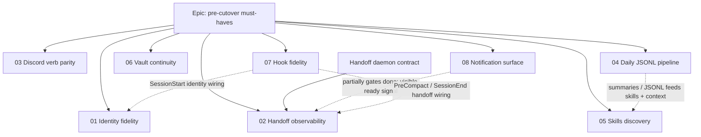
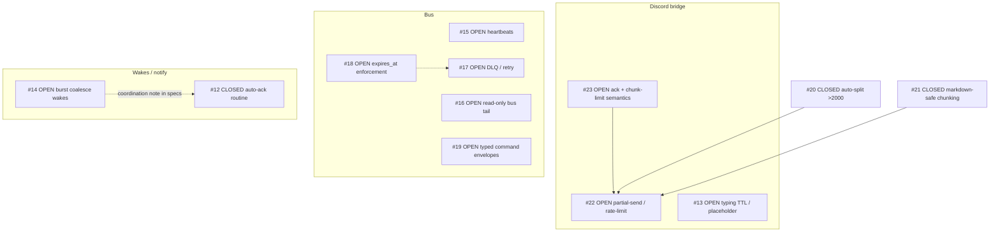

# Pepper cutover — agent playbook (multi-agent + PR owner)

**Purpose:** Tell any coding agent **how** to work on Pepper cutover tickets, **which specs exist**, and **how to record what it picked up**. Jeff (or the coordinator) fills the assignment table so you can glance at one file and know who owns what.

**People model (this repo right now):**

- **Up to three implementer agents** — write code, tests, and PR-ready branches. They do **not** decide global merge order and do **not** “just merge to main” unless Jeff explicitly says so.
- **One PR / integration agent** — owns **opening/updating PRs**, **merge sequencing**, **retargeting stacked PRs**, **conflict triage**, and **keeping CI green across the queue**. Implementers hand off a branch; the PR agent lands it.

Assume **other implementers are touching the same repo**. Prefer small, reviewable diffs and communicate overlap early.

**This playbook is on `main`.** Implementers always **`git pull` on `main`** then branch for their ticket. The old `feat/docs-pepper-cutover-agent-playbook` branch was only the vehicle to land this file — do not treat it as a shared development line.

---

## Who picks the ticket? (Agents do not “just know”)

- **Default:** an implementer only starts work after **Jeff fills the Assignment table** (`Assignee` + `Status`).
- **Exception:** Jeff (or the PR agent) explicitly tells you in chat / issue which row is yours — then mirror that into the table when you **Claim** it.
- The **dependency diagrams** below are for **merge sequencing and risk**, not for guessing ownership. If the table is empty, **stop and ask** rather than picking the “root” of the graph.

---

## Superpowers skills (**required** when the plugin is available)

**Policy:** If your environment has the **Superpowers** plugin, you **must** use it as the primary operating loop — not optional polish.

1. **Start of session / substantive work:** read and follow **`using-superpowers`** (Skill tool / skill read) before writing code or “exploring.”
2. **Multi-step or ambiguous work:** run **`writing-plans`** before large diffs.
3. **Behavior change or bugfix:** prefer **`test-driven-development`**; use **`systematic-debugging`** for failures before speculative fixes.
4. **Before claiming done or asking the PR agent to merge:** run **`verification-before-completion`** (evidence: commands + outcome).
5. **Large or risky change before merge:** **`requesting-code-review`** (or equivalent host review).
6. **Branch is green, need integration / merge guidance:** **`finishing-a-development-branch`**.

| When | Skill (typical slug / folder name) |
|------|-------------------------------------|
| Session start / any real implementation | `using-superpowers` |
| Multi-step / unclear scope | `writing-plans` |
| Behavior change or bugfix | `test-driven-development` + `systematic-debugging` |
| Before “done” / merge handoff | `verification-before-completion` |
| Pre-merge confidence | `requesting-code-review` |
| After CI green, integration choices | `finishing-a-development-branch` |

If Superpowers is **not** installed in your host, still mirror the **same discipline** (plan → test-first when appropriate → debug with evidence → verify before done).

---

## Non-negotiable workflow — one ticket, one worktree, one branch

Each implementer works **one active ticket at a time** from a **dedicated git worktree** so parallel agents do not stomp the same working tree.

### 1) Pick your ticket from the assignment table below

Only work on a row that lists **you** (or your agent id) in **Assignee**. If the table is empty, **stop** and ask Jeff to assign the row before writing code.

### 2) Create a worktree + branch from current `main`

Naming convention:

- **Branch:** `feat/cutover-NN-short-slug` (match the ticket number `NN`).
- **Worktree folder:** `.worktrees/cutover-NN-short-slug` under the repo root (keeps them grouped and out of the way).

**PowerShell (Windows) example** — run from the repo root `agent_core/` (not inside another worktree unless you mean to):

```powershell
cd E:\workspaces\ai\agents\agent_core
git fetch origin
git switch main
git pull origin main

$slug = "cutover-02-handoff-observability"   # change per ticket
git worktree add .worktrees\$slug -b feat/cutover-02-handoff-observability origin/main
cd .worktrees\$slug
```

Then install deps if needed (`uv sync` in `packages/core`, etc. — follow existing repo docs).

### 3) Implement against the ticket spec

- Read the **ticket spec** linked in the table (source of truth for “done”).
- Read **parent / related** docs linked from that ticket (especially the pre-cutover epic and daemon contract when touching handoff).

### 4) Commit and push; hand off to the PR agent

- **Commit messages:** imperative mood, scoped prefix, explain *why* when non-obvious.
- **Push** your `feat/cutover-NN-...` branch to `origin`.
- **Do not merge** unless Jeff explicitly overrides this playbook.
- Tell the PR agent: branch name, ticket id, what you ran (tests/lint), and any **dependencies** (e.g. “stack on top of PR #xyz”).

### 5) After your PR merges

- Mark the ticket row **Merged** (or clear Assignee) in the table below.
- Remove or archive the worktree when idle:

```powershell
cd E:\workspaces\ai\agents\agent_core
git worktree remove .worktrees\cutover-02-handoff-observability
git branch -d feat/cutover-02-handoff-observability   # optional local cleanup
```

---

## Coordination rules (keep three agents + one PR agent coherent)

1. **One ticket → one branch → one PR** unless two tickets are truly inseparable. If they depend on each other, use a **stack** (child branch based on parent branch) and tell the PR agent explicitly.
2. **Do not share branches** between implementers.
3. **Partition by area** when you can (Discord vs hooks vs daily pipeline) to reduce merge conflicts.
4. If two tickets **must** touch the same hot files, **serialize** (one assignee / one PR at a time) instead of parallelizing.
5. **PR agent owns merge order** for dependencies (e.g. notification surface vs handoff observability). Implementers should not “guess” landing order beyond what the specs say.
6. **Conflict policy:** whoever is on the **child** branch in a stack usually rebases onto the updated parent after the parent merges; PR agent coordinates if unclear.

---

## Dependency diagrams (merge / stack hints — **not** for self-assigning)

Use these with the **PR agent** to decide **landing order** or **stacked PR bases**. They do **not** replace the **Assignment table** for who works what.

### Pepper cutover specs (#01–#08 + epic)



- **Solid `EP -->`:** epic child ticket (all must close for cutover gate — see epic doc).
- **Solid `DC -->`:** daemon contract is the handoff implementation shape for **#02**.
- **Dashed `-.->`:** integration / sequencing coupling (land or scope the tail first when possible).

### GitHub issues (`jeffrichley/agent_core`)

Issues change; refresh with:

`gh issue list --repo jeffrichley/agent_core --state open`

Snapshot **2026-05-02** (edges = product / sequencing intuition, not GitHub “blocked by” metadata):



**Cutover ↔ GitHub (theme only):** Cutover **#03** aligns with **Discord** issues; **#04 / #08** align with **Bus** + **notify** work; **#02 / #08** align with **Wakes**. There is **no strict 1:1** between cutover doc numbers and GitHub issue numbers — use both tables plus Jeff’s assignment.

---

## Ticket index — all specs in this workstream

### Epic (parent)

| Id | Spec |
|----|------|
| Pre-cutover epic | [`pepper-pre-cutover-must-haves.md`](pepper-pre-cutover-must-haves.md) — child table + cutover gate |

### Cutover tickets (the numbered queue)

| # | Spec |
|---|------|
| 01 | [`pepper-cutover-01-identity-fidelity.md`](pepper-cutover-01-identity-fidelity.md) |
| 02 | [`pepper-cutover-02-handoff-observability.md`](pepper-cutover-02-handoff-observability.md) |
| 03 | [`pepper-cutover-03-discord-verb-parity.md`](pepper-cutover-03-discord-verb-parity.md) |
| 04 | [`pepper-cutover-04-daily-jsonl-pipeline.md`](pepper-cutover-04-daily-jsonl-pipeline.md) |
| 05 | [`pepper-cutover-05-skills-discovery.md`](pepper-cutover-05-skills-discovery.md) |
| 06 | [`pepper-cutover-06-vault-continuity.md`](pepper-cutover-06-vault-continuity.md) |
| 07 | [`pepper-cutover-07-hook-fidelity.md`](pepper-cutover-07-hook-fidelity.md) |
| 08 | [`pepper-cutover-08-notification-surface.md`](pepper-cutover-08-notification-surface.md) |

### Supporting / adjacent specs (read when relevant)

| Spec | When to read |
|------|----------------|
| [`pepper-handoff-daemon-contract.md`](pepper-handoff-daemon-contract.md) | Handoff bus, daemon writer, hook-minimal enqueue — **tight coupling to #02** |
| [`pepper-requirements.md`](pepper-requirements.md) | Original hook + tool expectations |
| [`pepper-identity-injection-size-limit.md`](pepper-identity-injection-size-limit.md) | Identity truncation / injection limits — **#01** |
| [`pepper-handoff-writer-bugfix.md`](pepper-handoff-writer-bugfix.md) | Predecessor notes for handoff — **#02** |
| [`docs/examples/pepper-agent-core.yaml`](../examples/pepper-agent-core.yaml) | Example pipeline wiring — **#07**, parts of **#01** |
| [`docs/ROADMAP.md`](../ROADMAP.md) | Discord / skills / pipeline roadmap references |

**Dependency hints (not a substitute for reading specs):** #08 partially gates #02 (“ready” must be visible). #04 relates to #05 (summaries → skills). #07 references #01/#02 for content vs firing.

---

## Assignment table — Jeff fills this in

**Statuses:** `Unassigned` · `Claimed` · `PR open` · `Merged` · `Blocked`

| Ticket | Spec | Suggested branch | Assignee (agent id or name) | Status | Notes |
|--------|------|------------------|-----------------------------|--------|-------|
| Pre-cutover epic | [`pepper-pre-cutover-must-haves.md`](pepper-pre-cutover-must-haves.md) | _(n/a — tracking doc)_ | PR agent | | Keep child statuses in sync with reality |
| 01 | [`pepper-cutover-01-identity-fidelity.md`](pepper-cutover-01-identity-fidelity.md) | `feat/cutover-01-identity-fidelity` | | | |
| 02 | [`pepper-cutover-02-handoff-observability.md`](pepper-cutover-02-handoff-observability.md) | `feat/cutover-02-handoff-observability` | | | See daemon contract |
| 03 | [`pepper-cutover-03-discord-verb-parity.md`](pepper-cutover-03-discord-verb-parity.md) | `feat/cutover-03-discord-verb-parity` | | | |
| 04 | [`pepper-cutover-04-daily-jsonl-pipeline.md`](pepper-cutover-04-daily-jsonl-pipeline.md) | `feat/cutover-04-daily-jsonl-pipeline` | | | |
| 05 | [`pepper-cutover-05-skills-discovery.md`](pepper-cutover-05-skills-discovery.md) | `feat/cutover-05-skills-discovery` | | | |
| 06 | [`pepper-cutover-06-vault-continuity.md`](pepper-cutover-06-vault-continuity.md) | `feat/cutover-06-vault-continuity` | | | |
| 07 | [`pepper-cutover-07-hook-fidelity.md`](pepper-cutover-07-hook-fidelity.md) | `feat/cutover-07-hook-fidelity` | | | |
| 08 | [`pepper-cutover-08-notification-surface.md`](pepper-cutover-08-notification-surface.md) | `feat/cutover-08-notification-surface` | | | Coordinate with #02 |
| Daemon contract | [`pepper-handoff-daemon-contract.md`](pepper-handoff-daemon-contract.md) | _(same branch as #02 unless split)_ | | | Often same implementer as #02 |

**How Jeff should use this:** put `Agent-A` / `Agent-B` / `Agent-C` (or model names) in **Assignee** for exactly one active row per agent. PR agent follows **PR open → Merged** and updates **Notes** with PR URLs and stack bases.

---

## PR agent checklist (merge owner)

1. Confirm each PR has: ticket id, what changed, how to verify, and declared dependencies.
2. Choose **merge vs stack** for dependent branches; retarget GitHub PR bases as needed.
3. Land **parent-first** in a stack; ping implementer for rebase after each merge.
4. Keep the **epic table** in [`pepper-pre-cutover-must-haves.md`](pepper-pre-cutover-must-haves.md) accurate when a child truly ships (per that doc’s intent).

---

## Handoff template (paste into PR description or chat)

```text
Ticket: Cutover #NN
Branch: feat/cutover-NN-slug
Worktree: .worktrees/cutover-NN-slug
Depends on: (none | branch name / PR link)
Risk: (low / medium / high)
Verified: (commands you ran, e.g. uv run pytest packages/core/tests/...)
Follow-ups: (optional)
```

This file lives next to the specs: [`pepper-cutover-agent-playbook.md`](pepper-cutover-agent-playbook.md).
