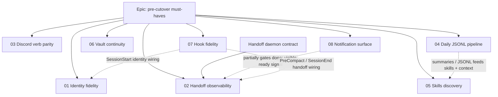
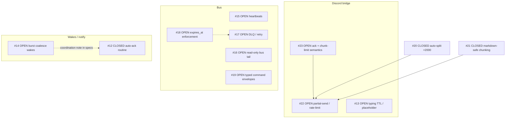

# Pepper cutover — agent playbook (multi-agent + PR owner)

**Purpose:** Tell any coding agent **how** to work on Pepper cutover tickets, **which specs exist**, and **how to record what it picked up**. Default **Assignee** names are filled below; Jeff (or **Cadence**) may reassign.

**People model (named roster):**

- **Vale**, **Locke**, **Folio** — implementers (code, tests, PR-ready branches). They do **not** decide global merge order and do **not** merge to `main` unless Jeff explicitly overrides this playbook.
- **Cadence** — PR / integration agent: **opening/updating PRs**, **merge sequencing**, **retargeting stacked PRs**, **conflict triage**, **CI**. Implementers hand off branches; Cadence lands them.

Assume **other implementers are touching the same repo**. Prefer small, reviewable diffs and communicate overlap early.

**This playbook is on `main`.** Implementers always **`git pull` on `main`** then branch for their ticket. The old `feat/docs-pepper-cutover-agent-playbook` branch was only the vehicle to land this file — do not treat it as a shared development line.

---

## Communication with Cadence (**PR comments only**)

There are **no side channels** for cutover coordination: no DM, no separate “tell Cadence in chat.”

- **Default:** Vale, Locke, and Folio talk to **Cadence** only by posting on the **GitHub PR** (comments on the `feat/cutover-*` branch’s PR, including review threads).
- **Fallback:** a **file in the repo** is allowed only when a PR thread truly cannot be used; if you do that, still link the commit or path in the PR once it exists so Cadence has one place to look.
- **Cadence** replies on the same PR (approve, request changes, merge notes, stack instructions).

Full protocol summary: [`pepper-cutover-cadence-queue.md`](pepper-cutover-cadence-queue.md) (Cadence runbook — name is legacy).

---

## Who picks the ticket? (Agents do not “just know”)

- **Default:** an implementer only starts work when **their name** is in **Assignee** for that row and they move **Status** to `Claimed` when they begin.
- **Exception:** Jeff (or **Cadence**) reassigns by editing the playbook on **`main`** (doc PR) or by a **comment on the relevant cutover PR** — mirror that into the table.
- The **dependency diagrams** below are for **merge sequencing and risk**, not for guessing ownership. If **your name** is not on any row you intend to work, **stop and ask** Jeff (or Cadence) to assign before coding.

---

## Superpowers skills (**required** when the plugin is available)

**Policy:** If your environment has the **Superpowers** plugin, you **must** use it as the primary operating loop — not optional polish.

1. **Start of session / substantive work:** read and follow **`using-superpowers`** (Skill tool / skill read) before writing code or “exploring.”
2. **Multi-step or ambiguous work:** run **`writing-plans`** before large diffs.
3. **Behavior change or bugfix:** prefer **`test-driven-development`**; use **`systematic-debugging`** for failures before speculative fixes.
4. **Before claiming done or asking the PR agent to merge:** run **`verification-before-completion`** (evidence: commands + outcome).
5. **Large or risky change before merge:** **`requesting-code-review`** (or equivalent host review).
6. **Branch is green, need integration / merge guidance:** **`finishing-a-development-branch`**.

| When | Skill (typical slug / folder name) |
|------|-------------------------------------|
| Session start / any real implementation | `using-superpowers` |
| Multi-step / unclear scope | `writing-plans` |
| Behavior change or bugfix | `test-driven-development` + `systematic-debugging` |
| Before “done” / merge handoff | `verification-before-completion` |
| Pre-merge confidence | `requesting-code-review` |
| After CI green, integration choices | `finishing-a-development-branch` |

If Superpowers is **not** installed in your host, still mirror the **same discipline** (plan → test-first when appropriate → debug with evidence → verify before done).

---

## Non-negotiable workflow — one ticket, one worktree, one branch

Each implementer works **one active ticket at a time** from a **dedicated git worktree** so parallel agents do not stomp the same working tree.

### 1) Pick your ticket from the assignment table below

Only work on a row that lists **your roster name** (`Vale` / `Locke` / `Folio`) in **Assignee**. Keep **at most one** row in `Claimed` or `PR open` per implementer at a time unless Jeff says otherwise.

### 2) Create a worktree + branch from current `main`

Naming convention:

- **Branch:** `feat/cutover-NN-short-slug` (match the ticket number `NN`).
- **Worktree folder:** `.worktrees/cutover-NN-short-slug` under the repo root (keeps them grouped and out of the way).

**PowerShell (Windows) example** — run from the repo root `agent_core/` (not inside another worktree unless you mean to):

```powershell
cd E:\workspaces\ai\agents\agent_core
git fetch origin
git switch main
git pull origin main

$slug = "cutover-02-handoff-observability"   # change per ticket
git worktree add .worktrees\$slug -b feat/cutover-02-handoff-observability origin/main
cd .worktrees\$slug
```

Then install deps if needed (`uv sync` in `packages/core`, etc. — follow existing repo docs).

### 3) Implement against the ticket spec

- Read the **ticket spec** linked in the table (source of truth for “done”).
- Read **parent / related** docs linked from that ticket (especially the pre-cutover epic and daemon contract when touching handoff).

### 3b) Already implemented or only partly done?

Several cutover items may already be **partially or fully built** on `main` (example configs, hooks, or endpoints landed ahead of the doc). That is normal. **Do not re-implement** behavior that already satisfies the spec.

**Before you write a lot of code:**

1. **Map the spec to the repo** — search packages and `docs/examples/` for the tools, events, and filenames the ticket names. Skim recent `main` history if helpful.
2. **Check “Done looks like” literally** — list each acceptance bullet and mark it **met / partial / missing** with evidence (command output, file path, or test name). Put that matrix in the **PR description** or a **PR comment** so **Cadence** can review without guessing.
3. Then choose one path:

| Situation | What to do |
|-----------|------------|
| **All acceptance criteria met** on current `main` | Open a small PR (still `feat/cutover-NN-…`) that **only** adds or tightens **tests**, **docs**, or **status** updates (ticket + epic + playbook rows) so “done” is **auditable** and the ledger matches reality. Hand off to **Cadence** with **Verified** filled in; the PR may be merge-only after her review. |
| **Partially met** | Same branch: implement **only the gaps**. Keep the PR description’s **gap list** in sync as you close items. Avoid scope creep beyond the ticket. |
| **Wrong shape** (built behavior diverges from the spec) | Prefer **one PR** that aligns behavior to the spec (or propose a spec change in a **separate** doc PR Jeff agrees to) — do not silently redefine “done” in code only. |

**Cadence:** treat “already done” PRs as first-class — verify the evidence matrix matches the ticket; merge if CI green and no spec drift. **Epic / ticket Status** should move to **Closed** (or equivalent) only when the spec and reality match, not when duplicate code lands.

### 4) Commit and push; hand off to **Cadence** (PR comment)

- **Commit messages:** imperative mood, scoped prefix, explain *why* when non-obvious.
- **Push** your `feat/cutover-NN-...` branch to `origin`.
- **Do not merge** unless Jeff explicitly overrides this playbook.
- **Signal Cadence (required):** post **one top-level PR comment** on that branch’s PR using the **Implementer → Cadence handoff** template below (same PR as your commits — open a **draft PR** early if you need Cadence before you are “finished”). Cadence is not notified anywhere else.
- **Cadence** will set playbook **Status** to `PR open` and **Notes** to the PR URL when she records the queue (small doc PR to `main` is fine).

### 4b) After you finish a ticket — check your PRs (**required**)

Before you **Claim** the next cutover row or start new work:

1. List **your** open PRs for this workstream (`feat/cutover-*` heads you own).
2. Read **every** comment thread from **Cadence** (reviews, “changes requested,” merge follow-ups). **Rework = new commits on the same PR** until Cadence merges or explicitly clears you.
3. Only then treat the prior ticket as fully handed off.

### 5) After your PR merges

- Mark the ticket row **Merged** (or clear Assignee) in the table below (Cadence or Jeff updates playbook via `main`).
- Remove or archive the worktree when idle:

```powershell
cd E:\workspaces\ai\agents\agent_core
git worktree remove .worktrees\cutover-02-handoff-observability
git branch -d feat/cutover-02-handoff-observability   # optional local cleanup
```

---

## Coordination rules (keep three agents + one PR agent coherent)

1. **One ticket → one branch → one PR** unless two tickets are truly inseparable. If they depend on each other, use a **stack** (child branch based on parent branch) and tell the PR agent explicitly.
2. **Do not share branches** between implementers.
3. **Partition by area** when you can (Discord vs hooks vs daily pipeline) to reduce merge conflicts.
4. If two tickets **must** touch the same hot files, **serialize** (one assignee / one PR at a time) instead of parallelizing.
5. **Cadence** owns merge order for dependencies (e.g. notification surface vs handoff observability). Implementers should not “guess” landing order beyond what the specs say; Cadence states stack decisions **in PR comments**.
6. **Conflict policy:** whoever is on the **child** branch in a stack usually rebases onto the updated parent after the parent merges; **Cadence** coordinates in the **child PR** comments.

---

## Dependency diagrams (merge / stack hints — **not** for self-assigning)

Use these with the **PR agent** to decide **landing order** or **stacked PR bases**. They do **not** replace the **Assignment table** for who works what.

### Pepper cutover specs (#01–#08 + epic)



- **Solid `EP -->`:** epic child ticket (all must close for cutover gate — see epic doc).
- **Solid `DC -->`:** daemon contract is the handoff implementation shape for **#02**.
- **Dashed `-.->`:** integration / sequencing coupling (land or scope the tail first when possible).

### GitHub issues (`jeffrichley/agent_core`)

Issues change; refresh with:

`gh issue list --repo jeffrichley/agent_core --state open`

Snapshot **2026-05-02** (edges = product / sequencing intuition, not GitHub “blocked by” metadata):



**Cutover ↔ GitHub (theme only):** Cutover **#03** aligns with **Discord** issues; **#04 / #08** align with **Bus** + **notify** work; **#02 / #08** align with **Wakes**. There is **no strict 1:1** between cutover doc numbers and GitHub issue numbers — use both tables plus Jeff’s assignment.

---

## Ticket index — all specs in this workstream

### Epic (parent)

| Id | Spec |
|----|------|
| Pre-cutover epic | [`pepper-pre-cutover-must-haves.md`](pepper-pre-cutover-must-haves.md) — child table + cutover gate |

### Cutover tickets (the numbered queue)

| # | Spec |
|---|------|
| 01 | [`pepper-cutover-01-identity-fidelity.md`](pepper-cutover-01-identity-fidelity.md) |
| 02 | [`pepper-cutover-02-handoff-observability.md`](pepper-cutover-02-handoff-observability.md) |
| 03 | [`pepper-cutover-03-discord-verb-parity.md`](pepper-cutover-03-discord-verb-parity.md) |
| 04 | [`pepper-cutover-04-daily-jsonl-pipeline.md`](pepper-cutover-04-daily-jsonl-pipeline.md) |
| 05 | [`pepper-cutover-05-skills-discovery.md`](pepper-cutover-05-skills-discovery.md) |
| 06 | [`pepper-cutover-06-vault-continuity.md`](pepper-cutover-06-vault-continuity.md) |
| 07 | [`pepper-cutover-07-hook-fidelity.md`](pepper-cutover-07-hook-fidelity.md) |
| 08 | [`pepper-cutover-08-notification-surface.md`](pepper-cutover-08-notification-surface.md) |

### Supporting / adjacent specs (read when relevant)

| Spec | When to read |
|------|----------------|
| [`pepper-handoff-daemon-contract.md`](pepper-handoff-daemon-contract.md) | Handoff bus, daemon writer, hook-minimal enqueue — **tight coupling to #02** |
| [`pepper-requirements.md`](pepper-requirements.md) | Original hook + tool expectations |
| [`pepper-identity-injection-size-limit.md`](pepper-identity-injection-size-limit.md) | Identity truncation / injection limits — **#01** |
| [`pepper-handoff-writer-bugfix.md`](pepper-handoff-writer-bugfix.md) | Predecessor notes for handoff — **#02** |
| [`docs/examples/pepper-agent-core.yaml`](../examples/pepper-agent-core.yaml) | Example pipeline wiring — **#07**, parts of **#01** |
| [`docs/ROADMAP.md`](../ROADMAP.md) | Discord / skills / pipeline roadmap references |
| [`pepper-cutover-cadence-queue.md`](pepper-cutover-cadence-queue.md) | **Cadence** runbook — PR-only comms (legacy filename) |

**Dependency hints (not a substitute for reading specs):** #08 partially gates #02 (“ready” must be visible). #04 relates to #05 (summaries → skills). #07 references #01/#02 for content vs firing.

---

## Assignment table — default owners (Jeff may reassign)

**Roster:** Vale, Locke, Folio (implementers) · **Cadence** (PR / merge).  
**Statuses:** `Unassigned` · `Claimed` · `PR open` · `Merged` · `Blocked`

| Ticket | Spec | Suggested branch | Assignee | Status | Notes |
|--------|------|------------------|----------|--------|-------|
| Pre-cutover epic | [`pepper-pre-cutover-must-haves.md`](pepper-pre-cutover-must-haves.md) | _(n/a — tracking doc)_ | **Cadence** | | Cadence keeps epic child statuses accurate |
| 01 | [`pepper-cutover-01-identity-fidelity.md`](pepper-cutover-01-identity-fidelity.md) | `feat/cutover-01-identity-fidelity` | **Vale** | Unassigned | |
| 02 | [`pepper-cutover-02-handoff-observability.md`](pepper-cutover-02-handoff-observability.md) | `feat/cutover-02-handoff-observability` | **Locke** | Unassigned | Pair with daemon row; coordinate **#08** with Folio |
| 03 | [`pepper-cutover-03-discord-verb-parity.md`](pepper-cutover-03-discord-verb-parity.md) | `feat/cutover-03-discord-verb-parity` | **Folio** | Unassigned | |
| 04 | [`pepper-cutover-04-daily-jsonl-pipeline.md`](pepper-cutover-04-daily-jsonl-pipeline.md) | `feat/cutover-04-daily-jsonl-pipeline` | **Vale** | Unassigned | |
| 05 | [`pepper-cutover-05-skills-discovery.md`](pepper-cutover-05-skills-discovery.md) | `feat/cutover-05-skills-discovery` | **Locke** | Unassigned | |
| 06 | [`pepper-cutover-06-vault-continuity.md`](pepper-cutover-06-vault-continuity.md) | `feat/cutover-06-vault-continuity` | **Folio** | Unassigned | |
| 07 | [`pepper-cutover-07-hook-fidelity.md`](pepper-cutover-07-hook-fidelity.md) | `feat/cutover-07-hook-fidelity` | **Vale** | Unassigned | Touches wiring for #01 / #02 |
| 08 | [`pepper-cutover-08-notification-surface.md`](pepper-cutover-08-notification-surface.md) | `feat/cutover-08-notification-surface` | **Folio** | Unassigned | Partially gates **#02** “done” path |
| Daemon contract | [`pepper-handoff-daemon-contract.md`](pepper-handoff-daemon-contract.md) | _(same branch as #02 unless split)_ | **Locke** | Unassigned | Same workstream as **#02** |

**Rules:** Each implementer keeps **one** row in `Claimed` or `PR open` at a time unless Jeff expands WIP. **Cadence** polls **`gh pr list`** for `feat/cutover-*` and reads **PR comments** (see runbook for filter example).

---

## Cadence — PR agent checklist (**Cadence**)

1. Poll open **`feat/cutover-*`** PRs (`gh pr list` — see [`pepper-cutover-cadence-queue.md`](pepper-cutover-cadence-queue.md)) and read **all new comments / reviews** on those PRs.
2. Confirm each PR has (in body or an implementer comment): ticket id, what changed, how to verify, and declared dependencies — use the **Implementer → Cadence handoff** template if missing.
3. Choose **merge vs stack** for dependent branches; state decisions **in a PR comment** on the affected PR(s).
4. Land **parent-first** in a stack; ask for rebase **via comment** on the child PR.
5. **If CI fails or the PR is not mergeable:** post the **Cadence → implementer rework** template (below) as a **PR comment** or formal **Request changes** review with the same fields in the body.
6. After merge: update playbook **Status** / **Notes** / epic child **Status** (small PR to `main` or combined doc update per Jeff).

---

## PR comment templates

### Implementer → Cadence (handoff — post as a **PR comment**)

Paste this into the **PR for `feat/cutover-NN-…`** (one comment per handoff is enough; you may also put a copy in the PR description when you first open it).

```text
To: Cadence
From: Vale | Locke | Folio
Ticket: Cutover #NN
Branch: feat/cutover-NN-slug
Worktree: .worktrees/cutover-NN-slug
Depends on: (none | branch name / PR link)
Risk: (low / medium / high)
Verified: (commands you ran, e.g. uv run pytest packages/core/tests/...)
Cadence: (open PR | merge when green | retarget stack | other)
Follow-ups: (optional)
```

### Cadence → implementer (rework / not ready to merge — post as **PR comment** or Request changes)

Use when CI is red, review finds issues, conflicts need a rebase, or the PR does not meet the ticket’s “done.” Be specific so the implementer does not need a side channel.

```text
To: Vale | Locke | Folio
From: Cadence
PR: (number + link)
Status: NOT MERGING | CHANGES REQUESTED
Reason: (CI failed | failing tests | spec gap | conflict | risk — pick one or more)
Details:
- (bullet: what is wrong or what failed)
- (bullet: expected fix or rebase target)
Next: (push fixes on this branch | rebase onto main | split PR — be explicit)
```

This file lives next to the specs: [`pepper-cutover-agent-playbook.md`](pepper-cutover-agent-playbook.md).
