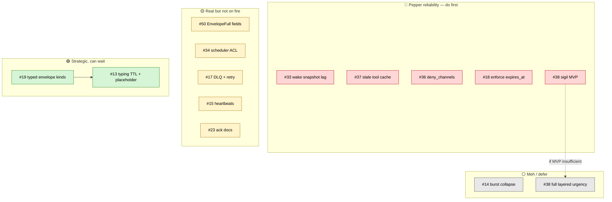

# Open Issues Cleanup Roadmap

> **Updated 2026-05-08.** Working backlog for `jeffrichley/agent_core`. Triage by urgency tier, not by sequential phase. Living document — keep it short.

## Status

- ✅ **Handoff pipeline reliability** — #44, #42, #43, #45 closed (PRs #46, #47).
- ✅ **Observability foundation** — #39, #16 closed (PRs #48, #49).
- 🔴 **In-flight: Pepper reliability cleanup** — see RED tier below. Must finish before any GREEN work.

## Triage

13 open issues:

| Tier | # | Title | Why this color | Cost |
|---|---|---|---|---|
| 🔴 RED | **#33** | Wake-builder count + urgency_max snapshot lag | Bug. Pepper can drop red-urgency items or get duplicate wakes. | 1-2d |
| 🔴 RED | **#37** | tools/list_changed not emitted; clients keep stale tool cache | Bit us during 2026-05-06 cutover. Today's workaround is `/exit + relaunch`. | 0.5-1d |
| 🔴 RED | **#36** | Discord deny_channels blocklist | We kludged "respond everywhere except #test" via Discord perms 2026-05-06. Needs proper fix. | 0.5d |
| 🔴 RED | **#18** | Enforce expires_at on envelopes | Stale messages get delivered hours later → confusing-bot moments in time-sensitive flows. | 1-2d |
| 🔴 RED | **#38 (MVP)** | Discord urgency: sigil prefix replacement | Current regex (`urgent\|now\|stop`) flags "right now we are looking at..." as red. Sigil MVP only — defer full layered design. | 1d |
| 🟡 YELLOW | **#50** | EnvelopeFull omits state-machine fields | Strict-spec gap on the work we just shipped. Tiny cost; closes #16 cleanly. | 0.5h |
| 🟡 YELLOW | **#34** | Scheduler ACL: ownership check on mutate ops | Security footgun. Single-operator masks it today, but a multi-agent setup is exposed. | 0.5-1d |
| 🟡 YELLOW | **#17** | Bus DLQ + retry policy + poison-message handling | Today `nack(requeue=True)` has no retry limit. Hasn't bit loudly, but is structural reliability debt. | 4-5d |
| 🟡 YELLOW | **#15** | Endpoint heartbeats / liveness | `list_endpoints` shows registered, not alive. Real value once a second agent talks to Pepper. | 2-3d |
| 🟡 YELLOW | **#23** | Discord ack contract docs | Pure docs but the contract is undocumented today (`message_id`/`message_ids`, `status=sent\|partial`, `MAX_CHUNKS`). Future agents will hit these. | 0.5d |
| 🟢 GREEN | **#19** | Typed envelope kinds (Reaction/Edit/DM/Status/DeleteMessage) | Cross-platform vocabulary, unlocks #13. Real but big — design-pass commitment. | 1-2w |
| 🟢 GREEN | **#13** | Typing indicator TTL + placeholder + edit | Nice UX. Cheap *after* #19 lands; expensive before (would invent a private convention). | 2-3d post-#19 |
| ⚪ GRAY | **#14** | Collapse rapid same-sender envelope bursts | Polite-to-have notification dedup. Pepper isn't actively complaining. Safe to leave forever if it never gets noisy. | 1-2d |

**RED total: ~4-6 days.** Items within a tier are mostly independent and parallelizable — see dependency diagram below.

## Dependencies

Only one hard dependency: **#13 → #19** (without typed kinds, the typing-indicator UX has to invent a private convention — possible but doubles the cost). #38 splits into MVP-now / full-later based on whether the sigil approach holds up. Everything else within a tier is independent and can ship in any order.

## Conventions

Per branch: `feat/issue-NN-<slug>` or `fix/issue-NN-<slug>`. One issue per PR. `Closes #NN` in the PR body for auto-close. Standard flow: brainstorming → writing-plans → subagent-driven-development.

Re-rank tiers if priorities shift. Move issues between tiers freely — that's the point of the triage shape over a phase shape.

## Related

- Strategic vision: `docs/ROADMAP.md`
- Deferred design items: `docs/BACKLOG.md`
- Per-feature plans: `docs/superpowers/plans/`
- Recent merges: PR #46 (#44), #47 (#42), #48 (#39), #49 (#16)
